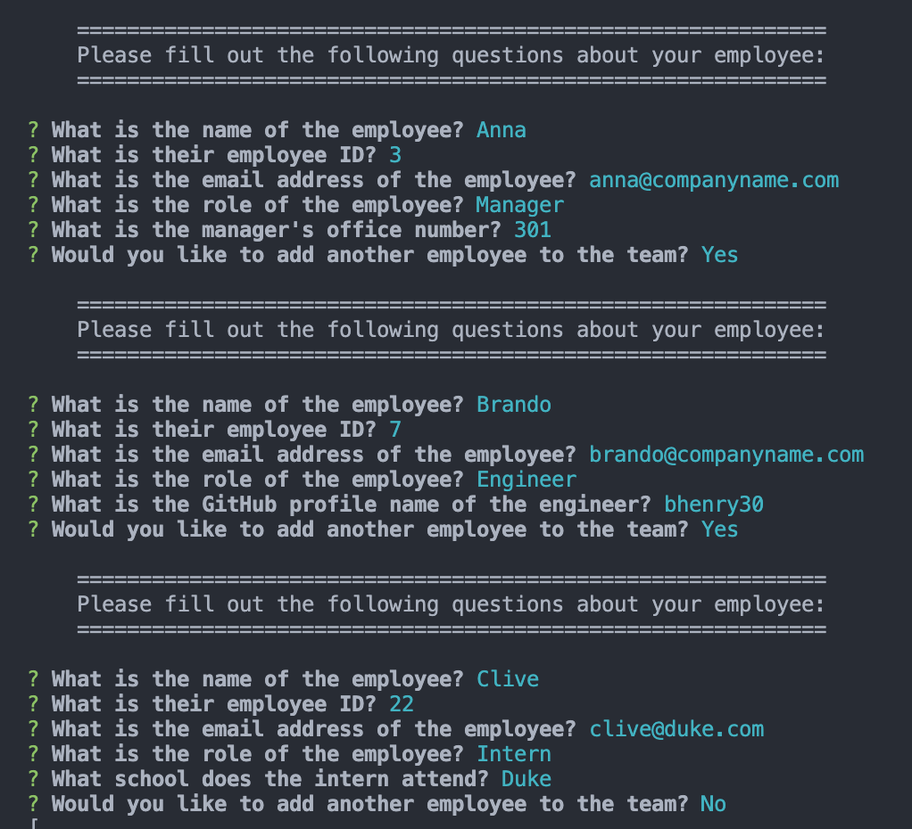

# Team Tracker

Team Tracker is an application that uses Inquirer prompts through Node.js to ask the user questions about their work team in order to generate employee cards with distinct information about the employees. 

## Using Team Tracker

* Run the index.js file with Node.js.
* Provide answers to the questions that follow
* The generated index.html file with appear in the dist folder.
* Click here to watch video on how to use Team Tracker

## Technologies

* HTML
* CSS
* Javascript
* Inquirer
* Node.js

## Link

## Contributers

* Brandon Henry